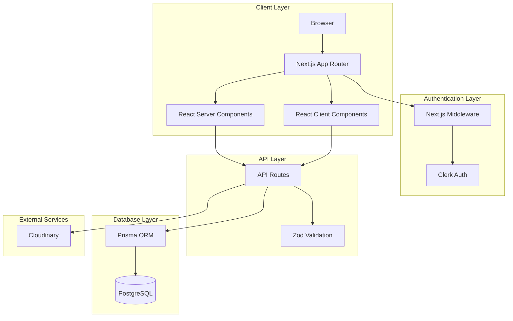
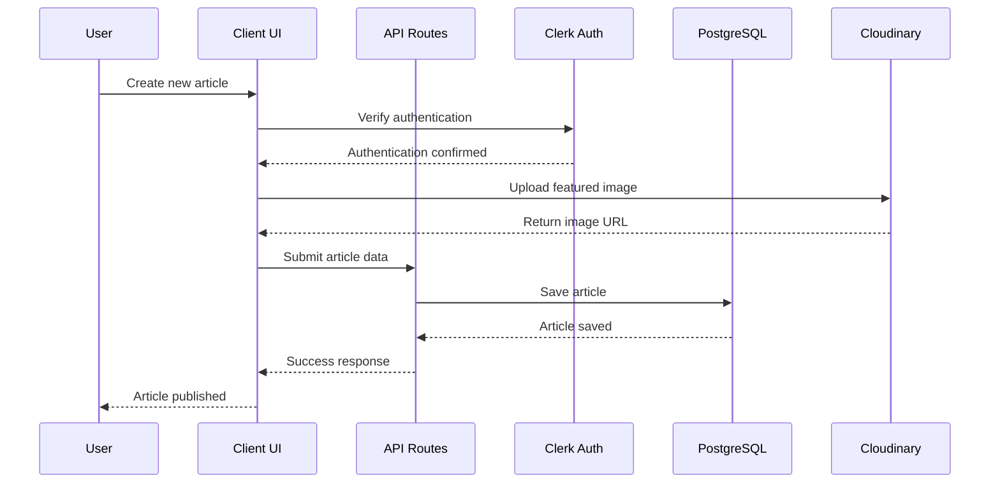
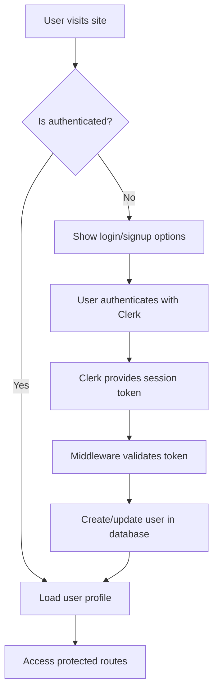
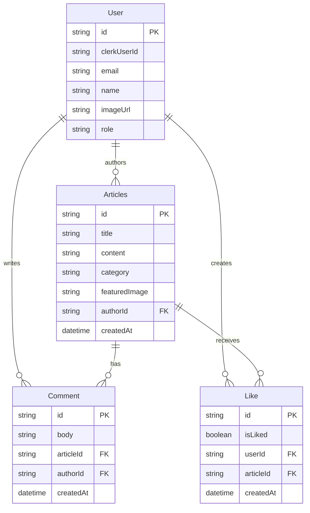
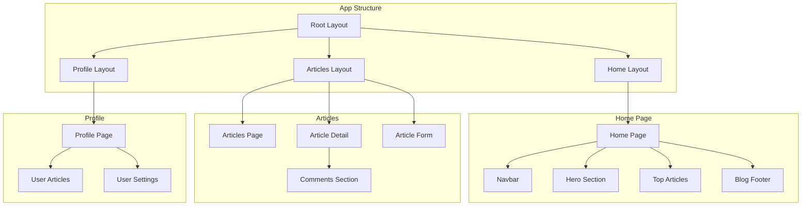
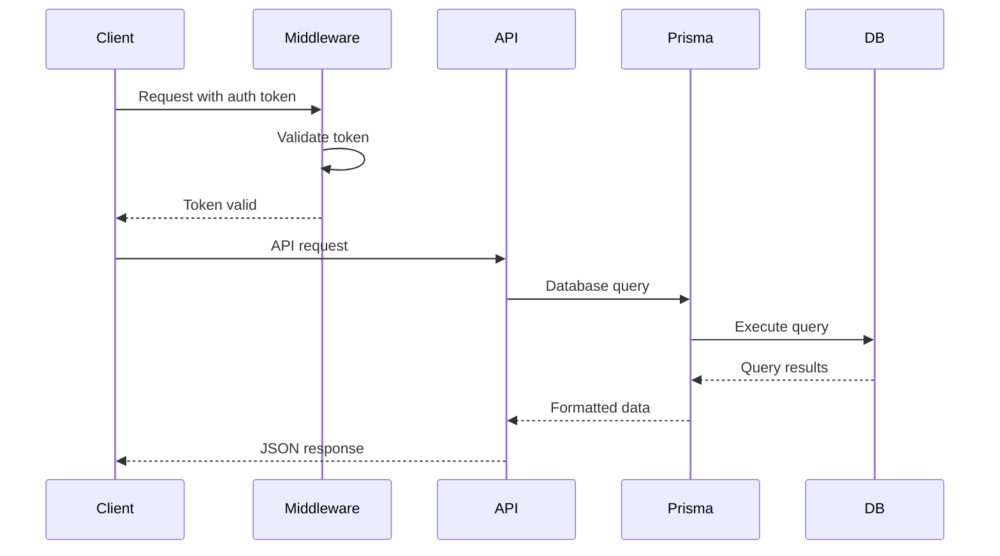

# Blog Application Architecture Flowchart

Below is a flowchart representation of the blog application architecture using Mermaid syntax. You can render this in any Markdown viewer that supports Mermaid.

## Application Architecture

## Data Flow for Article Creation

## User Authentication Flow

## Database Schema Relationships

## Component Hierarchy

## API Request Flow

